# Fishing Bot - Bachelor's Thesis Project

**Disclaimer:** This project is for educational purposes only.

This project aims to develop an automated fishing bot for the game "Rust" using machine learning techniques. The bot will detect when a fish bites the hook and perform the appropriate counter-movements to catch the fish successfully.

## Current Progress

- Implemented the `FishingBot` class that orchestrates the fishing process.
- Developed the `GameInteraction` class to handle interactions with the game, including:
   - Checking if the game is running.
   - Capturing the game screen.
   - Focusing the game window.
   - Moving the mouse to the fishing spot.
   - Casting the fishing line.
   - Observing the fishing state (fish movement and rod shake).
   - Performing counter-movements based on the model's predictions.
- Created the `FishBiteDetector` class to detect fish bites using sound analysis:
   - Recording audio from the game's speakers.
   - Processing the audio data to detect the fish bite sound cue.
   - Triggering the fishing minigame when a fish bite is detected.
- Implemented data preprocessing functions in `data_preprocessing.py` to load and preprocess the fishing sequences and labels.
- Developed the `FishingPredictor` class in `model_inference.py` to load a pre-trained model and make predictions for counter-movements based on the observed fishing state.
- Created `model_training.py` to train a Random Forest classifier on the fishing data and save the trained model.
- Implemented a basic LSTM model in `train_model.py` for sequence prediction.
- Developed `test_fishing_bot.py` to test the fishing bot functionality, including audio detection and game interaction.

## Planned Functions

- Enhance the `FishBiteDetector` class:
   - Improve the accuracy of fish bite detection by applying audio enhancement techniques and optimizing the similarity threshold.
   - Implement noise reduction and filtering to minimize false positives.
- Expand the `GameInteraction` class:
   - Add methods to detect when a fish is caught or unhooked based on game indicators.
   - Improve the efficiency of game screen capturing and processing.
- Refine the machine learning model:
   - Experiment with different model architectures and hyperparameters to improve prediction accuracy.
   - Explore advanced techniques such as ensemble methods or deep learning models.
   - Enhance the data preprocessing pipeline to handle more diverse fishing scenarios.
- Integrate the trained model into the `FishingPredictor` class:
   - Load the trained model and use it for real-time predictions during the fishing minigame.
   - Optimize the prediction process for low-latency response.
- Conduct extensive testing and evaluation:
   - Test the fishing bot in various fishing scenarios and assess its performance.
   - Evaluate the accuracy, response time, and success rate of the bot.
   - Identify and address any limitations or edge cases.
- Implement error handling and logging:
   - Add robust error handling mechanisms to gracefully handle exceptions and unexpected situations.
   - Incorporate logging functionality to track the bot's actions and diagnose issues.
- Enhance the user interface and configuration:
   - Develop a user-friendly interface to control the bot's settings and preferences.
   - Allow users to customize the bot's behavior and adjust parameters as needed.

## Decision Tree Visualization

The following decision tree represents the counter-movement prediction process based on the observed fishing state:

```mermaid
graph LR
    A[Datensammlung] --> B[Datenverarbeitung]
    B --> C[Modelltraining]
    C --> D[Entscheidungsfindung]
    D --> E[Aktionsausführung]
    E --> F[Feedback und Verbesserung]
    F --> C
```

The decision tree illustrates the key decision points and counter-movements based on the fish's movement direction and the intensity of the rod shake. The machine learning model will learn these decision rules from the labeled training data and make predictions accordingly during the fishing minigame.

## Future Work

- Explore advanced audio processing techniques to enhance fish bite detection accuracy.
- Investigate the use of computer vision techniques to detect visual cues and improve the bot's decision-making.
- Expand the bot's functionality to handle different types of fish and fishing environments.
- Optimize the bot's performance and resource utilization for long-term autonomous operation.
- Conduct user studies and gather feedback to improve the bot's usability and effectiveness.

Stay tuned for updates and further enhancements to the Fishing Bot project!

## Installation

1. Clone the repository: `git clone https://github.com/your-username/fishing-bot.git`
2. Install the required dependencies: `pip install -r requirements.txt`
3. Set up the game environment and configure the necessary settings.

## Usage

1. Run the `test_fishing_bot.py` script to start the fishing bot: `python test_fishing_bot.py`
2. The bot will automatically detect the game window and start the fishing process when a fish bite is detected.
3. Observe the bot's performance and monitor the console output for any relevant information or errors.

## License

This project is licensed under the MIT License.

Happy fishing!